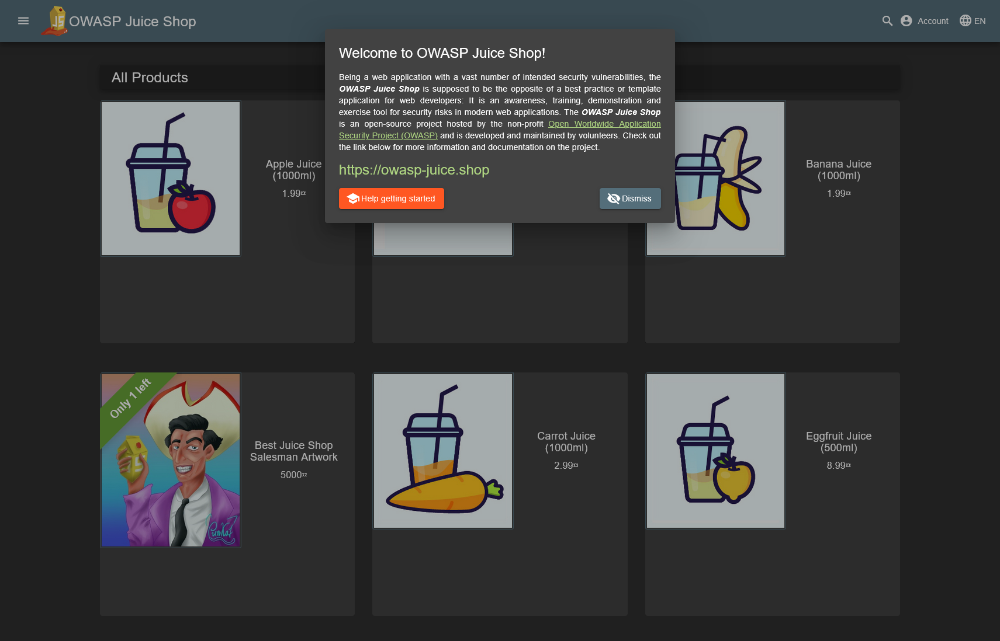
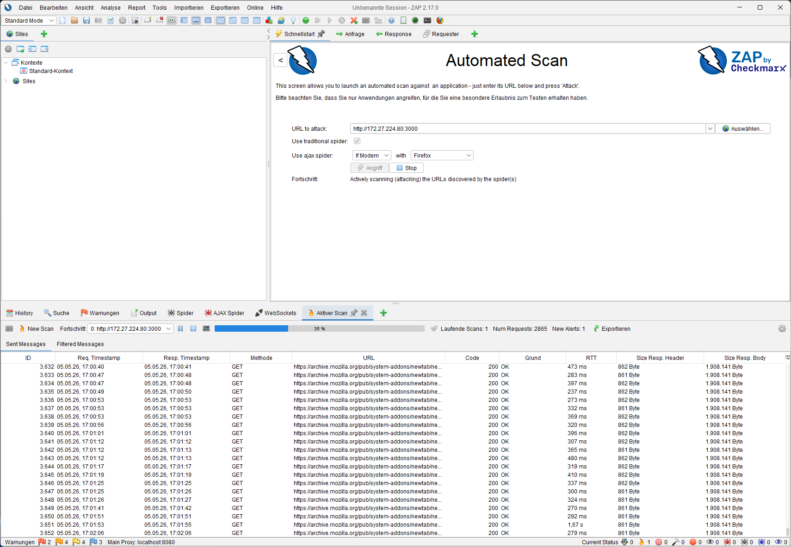
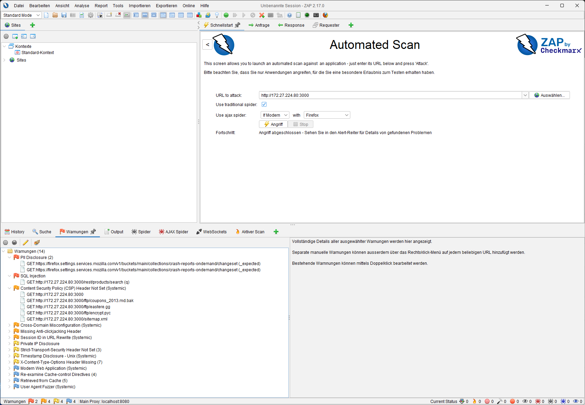
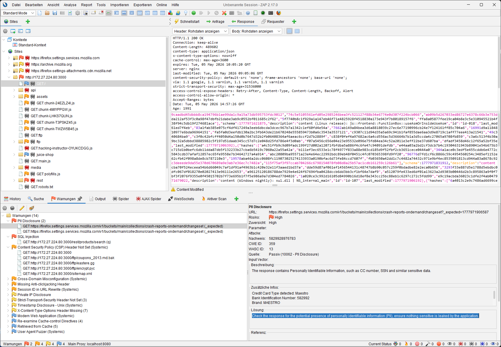
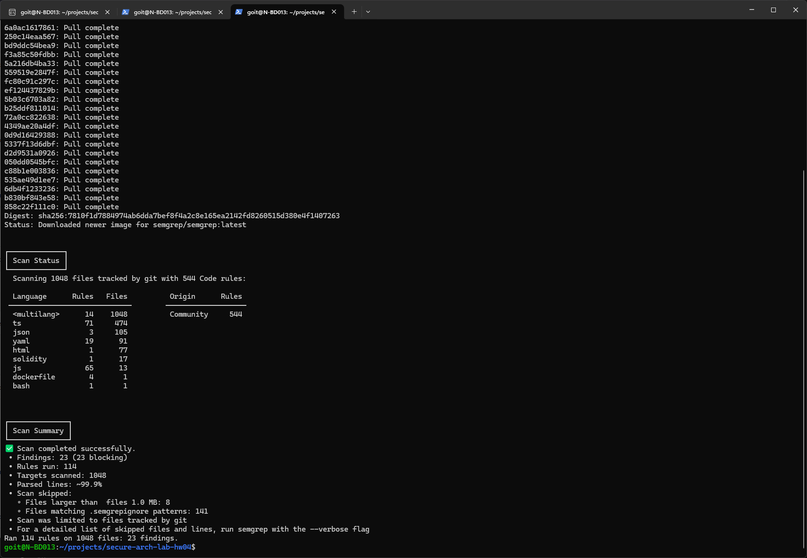

# HW04 — Аналіз і порівняння методів тестування безпеки

## 1. Лабораторна частина: DAST з OWASP ZAP

DAST-перевірка виконувалася за допомогою OWASP ZAP Desktop. Сканування було локальним: Juice Shop працював у Docker/WSL, а OWASP ZAP Desktop — у Windows, тому для DAST використовувалась WSL-адреса сервісу `http://172.27.224.80:3000/`.

Матеріали для перевірки результатів:

- HTML-звіт ZAP: [evidence/tool-runs/zap_results.html](https://github.com/andriy-pro/secure-arch-lab-hw04/blob/master/evidence/tool-runs/zap_results.html);
- зведення виявлень ZAP для цільового сервісу: [evidence/tool-runs/zap-alerts-summary.md](https://github.com/andriy-pro/secure-arch-lab-hw04/blob/master/evidence/tool-runs/zap-alerts-summary.md);
- скриншоти запуску й результатів: [01-juice-shop-running.png](https://github.com/andriy-pro/secure-arch-lab-hw04/blob/master/evidence/screenshots/01-juice-shop-running.png), [02-zap-scan-running.png](https://github.com/andriy-pro/secure-arch-lab-hw04/blob/master/evidence/screenshots/02-zap-scan-running.png), [03-zap-alert-summary.png](https://github.com/andriy-pro/secure-arch-lab-hw04/blob/master/evidence/screenshots/03-zap-alert-summary.png), [04-zap-selected-finding.png](https://github.com/andriy-pro/secure-arch-lab-hw04/blob/master/evidence/screenshots/04-zap-selected-finding.png).

Для аналізу взято виявлення, що стосуються локального екземпляра Juice Shop за адресою `http://172.27.224.80:3000/`.

<table class="pdf-table dast-table">
  <colgroup>
    <col style="width: 5%;">
    <col style="width: 28%;">
    <col style="width: 18%;">
    <col style="width: 49%;">
  </colgroup>
  <thead>
    <tr>
      <th>№</th>
      <th>Виявлення OWASP ZAP</th>
      <th>Ризик / достовірність</th>
      <th>Приклад URL</th>
    </tr>
  </thead>
  <tbody>
    <tr>
      <td>1</td>
      <td>SQL Injection</td>
      <td>High / Low</td>
      <td><code>GET /rest/products/search?q=%27%28</code></td>
    </tr>
    <tr>
      <td>2</td>
      <td>Content Security Policy Header Not Set</td>
      <td>Medium / High</td>
      <td><code>GET /</code></td>
    </tr>
    <tr>
      <td>3</td>
      <td>Cross-Domain Misconfiguration</td>
      <td>Medium / Medium</td>
      <td><code>GET /chunk-24EZLZ4I.js</code></td>
    </tr>
    <tr>
      <td>4</td>
      <td>Session ID in URL Rewrite</td>
      <td>Medium / High</td>
      <td><code>GET /socket.io/?...&amp;sid=oCSgl27LzFT4KybHAAAC</code></td>
    </tr>
    <tr>
      <td>5</td>
      <td>Missing Anti-clickjacking Header</td>
      <td>Medium / Medium</td>
      <td><code>POST /socket.io/?...&amp;sid=oCSgl27LzFT4KybHAAAC</code></td>
    </tr>
    <tr>
      <td>6</td>
      <td>X-Content-Type-Options Header Missing</td>
      <td>Low / Medium</td>
      <td><code>GET /socket.io/?EIO=4&amp;transport=polling...</code></td>
    </tr>
  </tbody>
</table>

### Коментарі до DAST-виявлень

1. **SQL Injection.** ZAP отримав `500 Internal Server Error` на ін'єкційний пошуковий запит. Для бізнесу це ризик витоку або зміни даних каталогу, а для команди розробки — пріоритетне виправлення, бо проблема зачіпає серверну логіку, а не лише заголовки відповіді.
2. **Content Security Policy Header Not Set.** Відсутній CSP-заголовок. Для SPA це важливо, бо CSP зменшує наслідки XSS та помилок у роботі з HTML/JavaScript; без нього навіть одна XSS-помилка може легше перетворитися на викрадення токенів або підміну дій користувача.
3. **Cross-Domain Misconfiguration.** ZAP виявив потенційно небезпечну міждоменну поведінку (cross-origin) на ресурсах застосунку. Вплив залежить від конкретної CORS-конфігурації: надто широкі правила можуть відкрити доступ до API з небажаних доменів.
4. **Session ID in URL Rewrite.** Ідентифікатор сесії потрапляє в URL. Такі значення можуть залишатися в логах, історії браузера або referrer-заголовках, тому інцидент може початися не з атаки на код, а з витоку технічних журналів.
5. **Missing Anti-clickjacking Header.** Відсутність `X-Frame-Options` або відповідної CSP-директиви може дозволити відкривати сторінку у frame та створювати clickjacking-сценарії. Бізнес-ризик тут нижчий, ніж у SQL Injection, але він важливий для сторінок з діями користувача.
6. **X-Content-Type-Options Header Missing.** Відсутній `X-Content-Type-Options: nosniff`. Це не найкритичніша проблема, але вона показує нестачу базового hardening; такі дрібні налаштування краще закривати разом із CSP/clickjacking-захистом.

Головна користь DAST у цій лабораторній роботі — перевірка застосунку як “чорної скриньки”: ZAP бачить реальні відповіді, заголовки, URL, статуси та поведінку API/SPA після запуску. Це особливо корисно для пошуку помилок конфігурації, проблем із заголовками безпеки (security headers), поведінки під час виконання та перевірки того, що вразливість справді проявляється через HTTP.

## 2. Лабораторна частина: SAST з Semgrep

SAST-перевірка виконувалася Semgrep по локальному коду Juice Shop. Semgrep запускався в Docker-контейнері `semgrep/semgrep:latest`.

Матеріали для перевірки результатів:

- JSON-звіт Semgrep: [reports/results_semgrep.json](https://github.com/andriy-pro/secure-arch-lab-hw04/blob/master/reports/results_semgrep.json);
- TSV-вибірка результатів: [evidence/tool-runs/semgrep-findings.tsv](https://github.com/andriy-pro/secure-arch-lab-hw04/blob/master/evidence/tool-runs/semgrep-findings.tsv);
- скриншот завершення команди: [05-semgrep-command-finished.png](https://github.com/andriy-pro/secure-arch-lab-hw04/blob/master/evidence/screenshots/05-semgrep-command-finished.png).

Semgrep знайшов 23 результати. Нижче подані чотири різні за типом приклади, які добре показують сильні сторони SAST.

<table class="pdf-table sast-table">
  <colgroup>
    <col style="width: 5%;">
    <col style="width: 27%;">
    <col style="width: 28%;">
    <col style="width: 40%;">
  </colgroup>
  <thead>
    <tr>
      <th>№</th>
      <th>Результат Semgrep</th>
      <th>Файл / місце</th>
      <th>Чому це важливо</th>
    </tr>
  </thead>
  <tbody>
    <tr>
      <td>1</td>
      <td>SQL-ін'єкція (SQL injection) у Sequelize</td>
      <td><code>src/routes/search.ts:23</code>, також <code>src/routes/login.ts:34</code></td>
      <td>Дані з HTTP-запиту потрапляють у SQL/ORM-запит. На відміну від DAST, SAST показує місце в коді, де треба перейти на параметризовані запити або безпечний query builder.</td>
    </tr>
    <tr>
      <td>2</td>
      <td>Жорстко прописаний JWT-секрет (hardcoded JWT secret)</td>
      <td><code>src/lib/insecurity.ts:56</code></td>
      <td>Секрет для JWT зберігається в коді. У реальному SSDLC такі значення мають бути в сховищі секретів або змінних середовища, а не в репозиторії.</td>
    </tr>
    <tr>
      <td>3</td>
      <td>Обхід шляхів (path traversal) через <code>res.sendFile</code></td>
      <td><code>src/routes/fileServer.ts:33</code>, також <code>src/routes/keyServer.ts:14</code>, <code>src/routes/logfileServer.ts:14</code>, <code>src/routes/quarantineServer.ts:14</code></td>
      <td>Користувацький ввід впливає на шлях до файлу. Це може дозволити читання неочікуваних файлів, якщо шлях не нормалізується і не обмежується дозволеною директорією.</td>
    </tr>
    <tr>
      <td>4</td>
      <td>Необроблений HTML (raw HTML) / можливий XSS</td>
      <td><code>src/routes/chatbot.ts:205</code></td>
      <td>Дані потрапляють у HTML, який формується вручну. Для такого коду потрібне екранування, санітизація або безпечна генерація HTML.</td>
    </tr>
  </tbody>
</table>

SAST корисний до запуску застосунку: його можна виконувати на PR, у CI або локально перед злиттям змін. Він показує конкретні рядки коду, тому добре підходить для швидкого виправлення дефектів на ранніх етапах SSDLC.

У реальній команді після базового запуску Semgrep варто додати кілька локальних правил під власний стек. Наприклад, для Juice Shop це могли б бути правила на заборону сирих SQL-рядків у маршрутах Express, небезпечного `sendFile` без allowlist і ручної вставки HTML без санітизації. Такі правила не замінюють стандартний набір Semgrep, але зменшують шум і краще ловлять повторювані помилки саме цього проєкту.

## 3. Порівняння SAST і DAST

| Критерій | SAST | DAST |
|---|---|---|
| Що аналізує | Код, конфігурацію, CI/CD-файли | Запущений застосунок через HTTP/API |
| Коли запускати | На етапі розробки, commit, PR, CI | У тестовому або передрелізному середовищі після деплою |
| Сильна сторона | Показує точний файл і рядок проблеми | Показує реальну поведінку під час виконання та вплив конфігурації |
| Обмеження | Може не знати, чи код реально досяжний під час виконання | Не завжди показує конкретне місце в коді |
| Приклад з цієї роботи | Semgrep знайшов SQL-ін'єкцію у `src/routes/search.ts` і жорстко прописаний JWT-секрет | ZAP знайшов SQL Injection через `/rest/products/search` і відсутні заголовки безпеки |

У цій роботі SAST і DAST доповнюють один одного. Наприклад, Semgrep показує місця в коді, де можливі SQL-ін'єкції, а ZAP показує, що одна з пошукових кінцевих точок API реагує на ін'єкційний рядок (payload) помилкою сервера. Так само Semgrep добре знаходить жорстко прописані секрети та обхід шляхів у коді, а ZAP краще бачить HTTP-заголовки, session ID у URL та CSP/CORS-конфігурацію.

## 4. Таблиця вразливостей Juice Shop і SSDLC

<table class="pdf-table ssdlc-table">
  <colgroup>
    <col style="width: 5%;">
    <col style="width: 31%;">
    <col style="width: 12%;">
    <col style="width: 22%;">
    <col style="width: 30%;">
  </colgroup>
  <thead>
    <tr>
      <th>№</th>
      <th>Вразливість / ризик</th>
      <th>Метод</th>
      <th>Інструмент</th>
      <th>Етап SSDLC</th>
    </tr>
  </thead>
  <tbody>
    <tr>
      <td>1</td>
      <td>SQL Injection у пошуку товарів</td>
      <td>SAST + DAST</td>
      <td>Semgrep, OWASP ZAP</td>
      <td>Розробка, CI, передрелізне середовище</td>
    </tr>
    <tr>
      <td>2</td>
      <td>Жорстко прописаний JWT-секрет</td>
      <td>SAST</td>
      <td>Semgrep</td>
      <td>Commit, CI, релізний контрольний гейт</td>
    </tr>
    <tr>
      <td>3</td>
      <td>Обхід шляхів у файлових маршрутах</td>
      <td>SAST</td>
      <td>Semgrep</td>
      <td>Розробка, перевірка коду, CI</td>
    </tr>
    <tr>
      <td>4</td>
      <td>Необроблений HTML / можливий XSS у chatbot route</td>
      <td>SAST, додатково DAST/IAST</td>
      <td>Semgrep, OWASP ZAP</td>
      <td>Розробка, інтеграційне тестування</td>
    </tr>
    <tr>
      <td>5</td>
      <td>Відсутні CSP / anti-clickjacking / посилення Content-Type</td>
      <td>DAST</td>
      <td>OWASP ZAP</td>
      <td>Передрелізне середовище, перевірка перед релізом</td>
    </tr>
    <tr>
      <td>6</td>
      <td>Session ID in URL Rewrite</td>
      <td>DAST</td>
      <td>OWASP ZAP</td>
      <td>Інтеграційне тестування, передрелізне середовище</td>
    </tr>
  </tbody>
</table>

### Рекомендовані дії для SSDLC

1. **SQL Injection у пошуку товарів.** Використати параметризовані запити, додати unit/integration тести на ін'єкційні рядки, запускати SAST у PR і DAST перед релізом.
2. **Жорстко прописаний JWT-секрет.** Прибрати секрет із коду, зберігати його в сховищі секретів або змінних середовища, додати перевірку секретів у CI.
3. **Обхід шляхів у файлових маршрутах.** Канонізувати шлях, перевіряти allowlist директорій, заборонити `..` та небезпечні сегменти, додати негативні тести.
4. **Необроблений HTML / можливий XSS у chatbot route.** Екранувати користувацькі дані, використовувати безпечні шаблони або санітизацію HTML.
5. **Відсутні CSP / anti-clickjacking / посилення Content-Type.** Додати CSP, `X-Frame-Options` або `frame-ancestors`, `X-Content-Type-Options: nosniff`, перевіряти заголовки після деплою.
6. **Session ID in URL Rewrite.** Не передавати session ID через URL, використовувати cookie з `HttpOnly`, `Secure`, `SameSite`, зменшити витік через логи та referrer.

Найкращий результат дає не один інструмент, а комбінація контрольних гейтів: SAST рано знаходить дефекти в коді, DAST перевіряє реальний деплой, а ручна перевірка допомагає оцінити бізнес-контекст і пріоритет виправлення.

Пріоритет виправлень для Juice Shop я б визначив так:

1. **SQL Injection** — виправити першою, бо це прямий ризик для даних і серверної логіки.
2. **Hardcoded JWT secret** — прибрати одразу після SQL Injection або паралельно, бо витік секрету знецінює автентифікацію.
3. **Path traversal і session ID in URL** — закрити наступними, бо вони можуть призвести до витоку файлів, токенів або службових журналів.
4. **CSP, anti-clickjacking і `X-Content-Type-Options`** — додати як окремий hardening-пакет перед релізом, щоб зменшити наслідки браузерних атак.

## 5. IAST або RASP: практичний сценарій

Для Juice Shop практичним доповненням був би IAST-сценарій у тестовому середовищі. IAST підключається до запущеного застосунку й аналізує, як дані реально проходять через код під час інтеграційних або end-to-end тестів.

Приклад сценарію:

1. Juice Shop запускається у тестовому або передрелізному середовищі.
2. До Node.js/Express застосунку підключається IAST agent.
3. Автоматизовані тести або тестувальник проходять основні сценарії: пошук товарів, login, chatbot, завантаження файлів, redirect, websocket/polling.
4. IAST фіксує потік даних (data flow) від HTTP-запиту до небезпечного приймача (sink): SQL query, HTML response, file path, redirect або token/session handling.
5. Результат потрапляє до черги завдань (backlog) з прив'язкою до кінцевої точки API (endpoint), стека викликів і критичності.

IAST був би корисним саме між SAST і DAST. Він краще за SAST розуміє, чи код реально виконується, і краще за DAST показує внутрішній шлях даних. Для навчального Juice Shop це допомогло б точніше оцінити SQL-ін'єкції, XSS-подібні ризики та обхід шляхів.

Саме тому IAST часто називають “золотою серединою”: він не просто бачить HTTP-відповідь, як DAST, і не просто статичний фрагмент коду, як SAST. Він пов'язує endpoint, payload, виконаний код, стек викликів і небезпечний sink в одному результаті. Це зручно для команди: розробник бачить, який тестовий сценарій дійшов до проблемного коду, а security engineer може швидше відрізнити реальний ризик від теоретичного спрацювання.

RASP більше підходить для захисту критичних систем у production. Наприклад, RASP може блокувати підозрілі SQL-рядки атаки або обхід шляхів під час виконання. Але для цієї лабораторної роботи IAST доречніший, бо завдання фокусується на аналізі та порівнянні методів тестування.

## 6. Вибір методів тестування для різних типів застосунків

| Тип застосунку | Рекомендовані методи | Як інтегрувати |
|---|---|---|
| REST API | SAST, DAST, за можливості IAST | SAST запускати на PR і в CI; DAST запускати в передрелізному середовищі за OpenAPI-специфікацією або набором API-запитів; IAST використовувати разом з integration tests для критичних кінцевих точок. |
| SPA / вебзастосунок | SAST, DAST, ручна перевірка заголовків безпеки | SAST перевіряє TypeScript/JavaScript, серверні маршрути і CI-конфігурацію; DAST перевіряє заголовки у відповідях запущеного застосунку, CORS/CSP, XSS-поведінку, роботу з сесіями; перед релізом корисно мати окремий контрольний список безпеки для браузерних ризиків. |

Для REST API головний акцент — валідація вхідних даних, авторизація, SQL/NoSQL injection, помилки доступу до ресурсів і безпечна робота з секретами. Для SPA важливі XSS, CSP, CORS, clickjacking, ризики залежностей і коректна робота з токенами. В обох випадках SAST краще ставити ближче до розробника, а DAST — ближче до реального середовища.

## Додаток: скриншоти виконання

Скриншот 1. Локальний OWASP Juice Shop запущений у Docker/WSL.

Скриншот 2. OWASP ZAP Desktop виконує DAST-перевірку локального сервісу.

Скриншот 3. Панель виявлень OWASP ZAP після сканування.

Скриншот 4. Приклад окремого виявлення OWASP ZAP.

Скриншот 5. Завершення запуску Semgrep і збереження результатів.

## 7. Висновок

У цьому завданні SAST і DAST показали різні, але взаємодоповнювальні сторони безпеки Juice Shop. Semgrep знайшов проблеми в коді: SQL-ін'єкцію, жорстко прописаний JWT-секрет, обхід шляхів і необроблений HTML. OWASP ZAP Desktop показав ризики під час виконання: SQL Injection через HTTP-запит, відсутні заголовки безпеки, session ID в URL та інші проблеми конфігурації.

Для стабільного SSDLC варто запускати SAST рано — на PR/CI, DAST — після деплою в тестове або передрелізне середовище, а IAST додавати для критичних потоків, де потрібно бачити реальний шлях даних у застосунку. Після сканування важливо не просто зберегти список виявлень, а розставити пріоритет: спочатку дефекти, що загрожують даним і автентифікації, потім витоки через файли/сесії, і вже після цього заголовки посилення захисту. Такий підхід зменшує шанс, що вразливість залишиться непоміченою або зависне без виправлення до релізу.
